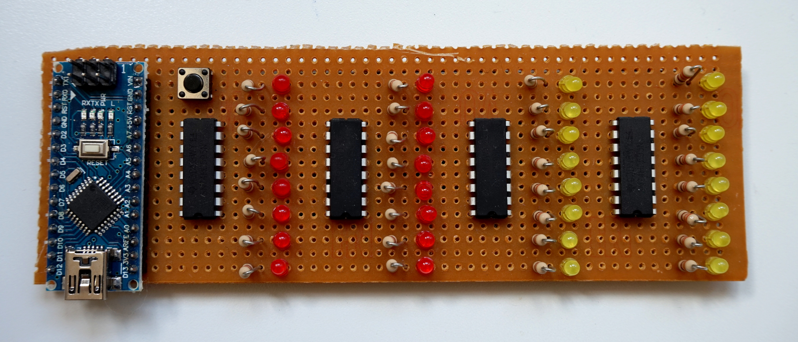

# IntegerFun

This is an exploratory project to get familiar with the Arduino libraries, the
IDE and Arduino Create web environment. The aim of this project is to generate,
manimpulate and display integers in various ways.

### Hardware

The hardware for this project consists of an Arduino Nano, four 74HC595 8-bit
shift registers, 32 LEDs, 32 330 Ohm resistors and a button to switch among
the various software options. Each output pin of the 74HC595 connects to a 330
Ohm resistor and a LED so that a full 32-bit integer can be displayed.

Digital pins 6 (DATA\_PIN), 5 (LATCH\_PIN) and 4 (CLOCK\_PIN) of the Arduino
have been selected to drive all four 74HC595 serial-in, parallel-out registers.
An additional pin 3 (INPUT\_PIN) is connected to the button and then to ground.

### Software

All functionality is included in the IntegerFun.cpp file, which needs to be
compiled against the Arduino library. Once the Arduino boots up, all
aforementioned pins are set to the right state: OUTPUT for pins connected to
the registers and INPUT\_PULLUP for the pin connected to the button. The
ATmega328 will then continuously execute function loop() and sleep for a second
between successive executions.

In each execution, a 32-bit integer will be displayed in the 32 LEDs (one bit
per LED), according to the mode that has been selected. The following modes are
currently supported:

1. **NOOP**: No operation, state of the LEDs does not change.
2. **RANDOM**: Display random numbers.
3. **PRIME**: Display prime numbers.
4. **CASCADE**: Display a cascading bit moving from least to most signifincat LED.
5. **COUNTER**: Display a counter that counts from 0 onwards.
6. **CLOCK**: Display a clock (second, minute, hour, day in each 8-bit segment).
7. **FIBONACCI**: Display numbers in the Fibonacci sequence.
8. **ABUNDANT**: Display abundant numbers.
9. **FACTORIAL**: Display the factorial of 1 and onwards.
10. **HAPPY**: Display happy numbers.
11. **JUGGLER**: Picks a random number and displays its Juggler sequence.
12. **COMPLEMENT**: Counts from 1 onwards, displays both the number and its complement.
13. **PERFECT**: Display perfect numbers.

Please have a look at Wikipedia or any other online resource for more
information about the integer sequences mentioned above.

### Galery

