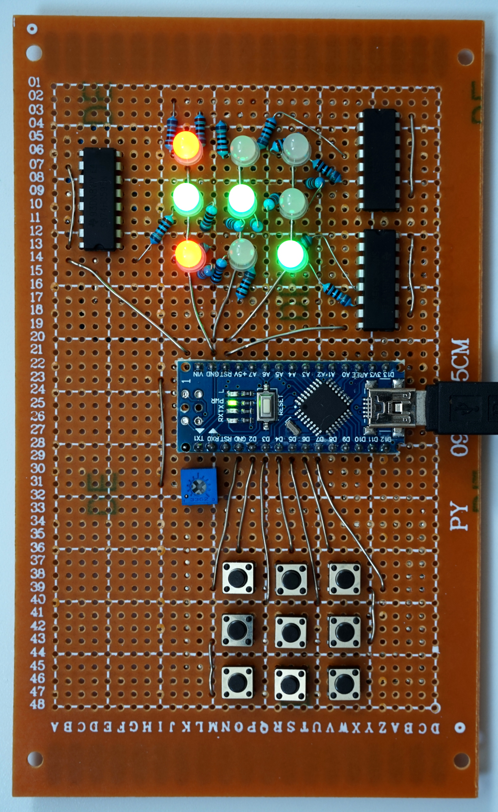
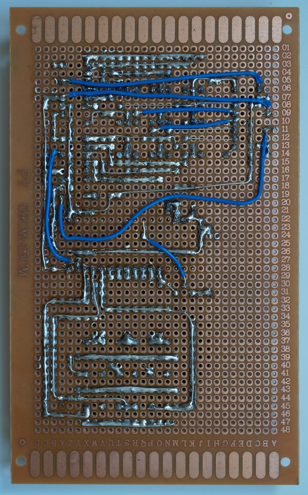
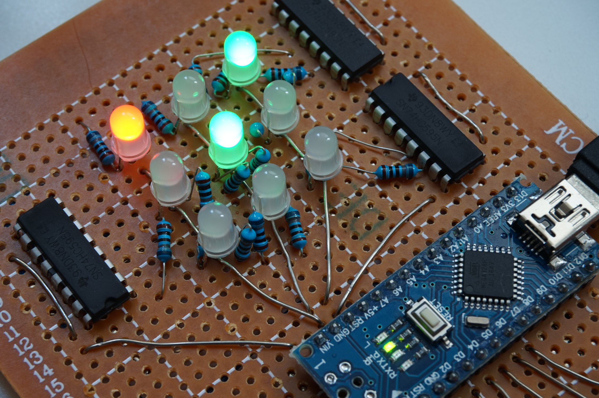
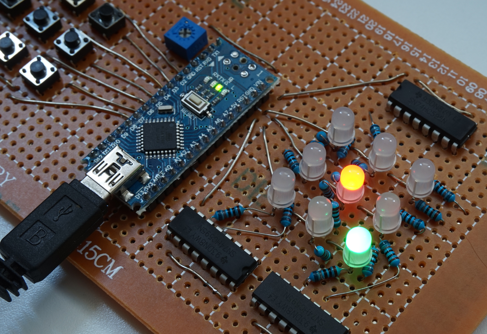

# TicTacToe

This project involves teaching an Arduino how to play TicTacToe against a human
player and beat them using the MiniMax algorithm. It is a challenging project
both on the hardware and the sofware side of things.

### Hardware

This project requires an Arduino Nano, 9 push buttons, 9 RGB LEDs, 18 680 Ohm
resistors, 3 74HC595 8-bit shift registers and a 1 KOhm variable resistor.

The push buttons are arranged in a square to form a keypad for user input. Each
button is connected to a digital input in the Arduino Nano, using pins D2 to
D10. These pins are configured as INPUT\_PULLUP to use the internal pull-up
resistor so that no noise is picked up during operation. Using the internal
pull-up resistors means that no additional external resistors are required.

The RGB LEDs are arranged in a similar square shape to form the TicTacToe game
board. Only the red and green channels are required for this project, to
represent TicTacToe users X and O respectively. The cathode of all LEDs is
connected to ground and the red and green anodes are connected to the 74HC595
output pins via a 680 Ohm resistor to limit the current flowing through them
and prolong their life.

Each 74HC595 8-bit shift register is responsible for driving a row of three
RGB LEDs on the game board. The circuit has been wired in such a way that the
first and last bits of every register remain unused. In more detail, the output
pins of each register are mapped as follows: U R G R G R G U, where U is unused,
R is the red channel and G is the green channel of an RGB LED.

The shift registers are connected with each other as a cascade and are
controlled using digital pins 11 (DATA\_PIN), 12 (LATCH\_PIN) and 13 (CLOCK\_PIN)
of the Arduino. Additionally, a 1 KOhm variable resistor is connected to Vcc,
ground and analog pin 6. This is used to control the depth of the MiniMax
algorithm and therefore how "smart" the Arduino player is going to be.

### Software

The MiniMax algorithm is used to analyse each possible move that the Arduino
player can make in the TicTacToe board and pick the one with the maximum
possible gain or the minimum possible loss. In summary, for every possible move
a full tree of subsequent moves is constructed up to the point where the board
reaches an end state (i.e. someone has won or is a draw). The end states are
then evaluated and an aggregate score is assigned to the original move. Finally,
the algorithm picks up the move with the highest aggregate score.

When the ATmega328 first boots up, it sets the correct pin mode to each input
and output pin and seeds the random number generated with noise picked up by
reading analog pin 0. In every loop it plays one game with a human player.
At the beginning of each itteration the board is cleared, a symbol (X or O)
is randomnly assigned to each player and the player who is going to make the
first move is randomly selected. The game game continues until either there is
a winner or it is a draw. If there is a winner, the board flashes three times.

### Gallery

